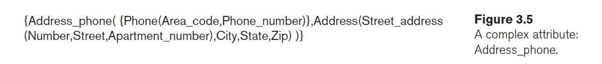

# ch3 important notes
## composite vs simple(atomic) attribute
- simple has only one thing to specifie like ssn
- composite to specifie it we need many things like name(fname,mname,lname) (hierarchy)
## stored vs derived attribute
- stored like birth date
- derived like age
## complex attribute 
- complex attribute contists of composite attributes and multivalued attributes 
- we put composite attributes between ()
- we put multivalued attribute between{}

## recursive relationship or self-refrencing relationship
- the same entity participate in the relation ex: supervise 
- in such case role name is essential 
## Cardinality ratios
- ex: 1:1 | 1:n | n:m
## Participation Constraints and Existence Dependencies
- ex: total or partial participation
## weak entity
- entities which doesn't have key attributes
- weak entity has partial key which is uniquely identiying for owener entity, it is being expressed by doted line under it
- weak entity and its realtionship are represented in erd by double line rectangle and diamond
## proper naming of schema constructs
- entity type and relationship type names are in uppercase letters, attribute names have their initial letter capitalized, and role names are in lowercase 