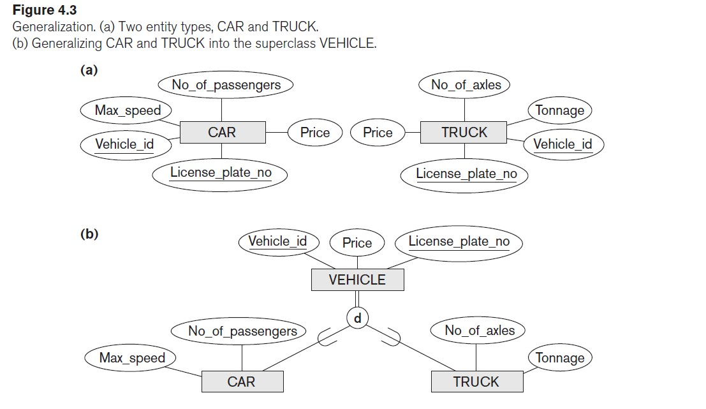
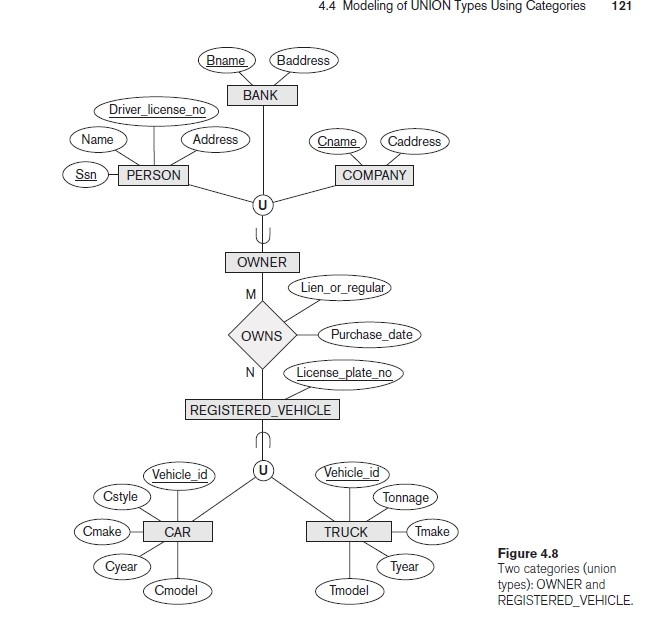

## Subclasses, Superclasses, and Inheritance
- inheritance in database is the same as in programming, sub entity has the same attributes for super but it have specific role
- sub class and super class are connected with arrow with arc as shown in that image

# Specialization and Generalization
## Specialization
- super is devided into many sub entities according to some properties
- we make specialization if we have some entities share the same attributes or if there is a relation between particular entity of our sub entites and another entity any where 
-up down

## Generalization
- collect some some entities that share some properties into super entiy 
- bottom up
  - notice that generlization and specialization are the same but one works from top to bottom the other is opposite

## Constraints on Specialization and Generalization
- condition of membership in specializaton is called defining predicate (or condition-defined)
- We display a predicate-defined subclass by writing the predicate condition next to the line that connects the subclass to the specialization circle.

- d -> may be in at most one of sub entities
- o -> overlapping that mean that a member may be in more than one sub entity
- total -> every entity in supper class must be member of subclass (double line)
- partial -> every entity in super may be member in sub entities or not (single line)
- ### insertation and delation 
  - Deleting an entity from a superclass implies that it is automatically deleted from all the subclasses to which it belongs.
  - Inserting an entity in a superclass implies that the entity is mandatorily inserted in all predicate-defined (or attribute-defined) subclasses for which the entity satisfies the defining predicate.
  - Inserting an entity in a superclass of a total specialization implies that the entity is mandatorily inserted in at least one of the subclasses of the specialization.
## Specialization and Generalization Hierarchies and Lattices
- a subclass inherits the attributes not only of its direct superclass, but also of all its predecessor superclasses all the way to the root of the hierarchy or lattice if necessary
- shared subclass with more than one super class is called shared subclass

- Notice that the existence of at least one shared subclass leads to a lattice (multible inheritance)
- if we have no shared subclass the we have hierarchy (single inheritance)
## Modeling of UNION Types Using Categories
- union entity is entity we ceate to expreess many entities which doesn't share any common attributes so that we can connect them with only one relation with another entities
- union is diffrent than shared entity
  - shared entity: entities share the same attributes (intersection)
  - category(union): entities are diffrent (union)
- if you can not understand see that video 
[Link](https://youtu.be/E4CzM-OLucI)
and see figure (4.6) & (4.8)
## diffrence between generized super class and category 
- generized super: every truck and every car must be vehicle
- category: he REGISTERED_VEHICLE category includes some cars and some trucks but not necessarily all of them ,it depend on type of specialization and generization (partial or total )

## Example of Other Notation: Representing Specialization and Generalization in UML Class Diagrams
- A blank triangle indicates a specialization/generalization with the disjoint constraint
- a filled triangle indicates an overlapping constraint

