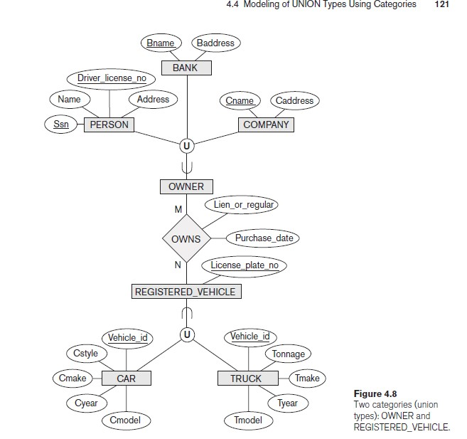

# mapping
- logical database design = data model mapping
- i map to connect all data whith each other to facilaties maintanance and update
- i chosse to tranfer to who is connsect with reation more bigger to reduce null values 
- 1:1 relation if there is no total partial participation then i can transfer primary key of any as foriegn of the other
  ## Mapping of Weak Entity Types
  - The primary key of R is the combination of the primary key(s) of the owner(s) and the partial key of the weak entity type W, if any.
  - If there is a weak entity type E2 whose owner is also a weak entity type E1, then E1 should be mapped before E2 to determine its primary key first.
  ## Mapping of Binary 1:1 Relationship Types
  - i transfer primary key of entity with partial participation to entity with total participation as a foreign key
  - *i transfer from small to large (mother give money of smaller to larger always)*
  ## Mapping of N-ary Relationship Types.
  - We use the relationship relation option. For each n-ary relationship type R, where n > 2, create a new relation ship relation S to represent R. Include as foreign key attributes in S the primary keys of the relations that represent the participating entity types. Also include any simple attributes of the n-ary relationship type (or simple components of composite attri butes) as attributes of S. The primary key of S is usually a combination of all the foreign keys that reference the relations representing the participating entity types. 

## Options for Mapping Specialization or Generalization.
the best option i use is the one that have very little null values so that i will use memory better
``` 
    remmember that o = overlapping ->  may be exist in multible subclasses
                   d = disjoint -> exist in only one of the subclasses
                   total => must be exist in any one of theses subclasses 
                   partial => may be exist or not

```
### Option 8A: Multiple relations—superclass and subclasses
- sub class: key of sub + key of super + attriputes of sub 
- super class : key of super + attributes pf super
- this option works for any specialization (total or partial, disjoint or overlapping)
### Option 8B: Multiple relations—subclass relations only
- make only tables for subclasses put in them its attributes and all attributes in the super 
- sub class: key of sub + key of super + attriputes of sub + attributes pf super
- super : not be maken 
- This option only works for a specialization whose subclasses are total and disjoint
<br>
## options 8C & 8D

<br>

### Option 8C: Single relation with one type attribute
- super class only: keys of subclasses + key of super + attriputes of sub + attributes pf super
- This option works only for a specialization whose subclasses are disjoint (d)
### Option 8D: Single relation with multiple type attributes
- super class only: keys of subclasses + key of super + attriputes of sub + attributes of super (sub class attributes are boolen attributes)
- This option is used for a specialization whose subclasses are overlapping (O)
## step 9:Mapping of Union Types (Categories)
- we make surrogate key when creating a relation to correspond to the union type. The keys of the defining classes are different, so we cannot use any one of them exclusively to identify all entities in the relation.
- we include the surrogate key attribute as foreign key in each relation corresponding to a superclass of the category(owener_id)
- for category whose superclasses have the same key there is no need for surrogate key.(vehicle)
- see that figure for more understand
  
  
  
