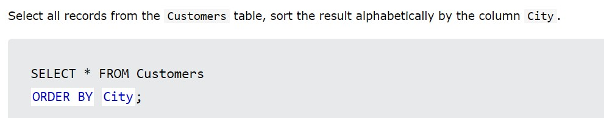

# MYSQL
## diifrence between SQL & MYSQL
- SQL: language with which i write commanads in MYSQL
- MYSQL: RDBMS
## diffrence between cascade 
- cascade when we delete one thing all data related with it will be deleted automatically
## index & unique & primary
- index: foreign key but we can repeat it
- unique: foreign key but we can not repeat it
- primary: primary key
## join 
- we use having instead of where
## group by
- we use it to can show all data depend on one column
  - ex: if we want to show avarage of student's grades in all subjects
  - we make select avg(student's grade) from student group by course name if we don not say group by course name it will say avg fro all courses
## connection 
- mysqli=> i stands for improved
- to connect with database
```php
<?php
$servername = "localhost";
$username = "username";
$password = "password";

try {
  $conn = new PDO("mysql:host=$servername;dbname=myDB", $username, $password);
  // set the PDO error mode to exception
  $conn->setAttribute(PDO::ATTR_ERRMODE, PDO::ERRMODE_EXCEPTION);
  echo "Connected successfully";
} catch(PDOException $e) {
  echo "Connection failed: " . $e->getMessage();
}
?>
```
## close connection
- $ conn=null;
# MYSQL notes question and answer
- Select all the different values from the Country column in the Customers table: 
  select distinct Country FROM Customers





## storage procedure
- search if you need it
- with it i can make quere and excute it with only one click
## view search for it
## trigger 
- with it i can do something if i did another thing
- i can make with it backup for deleted database for example