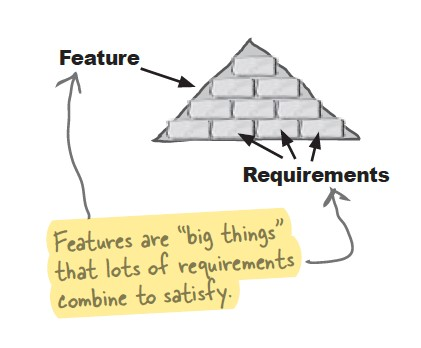
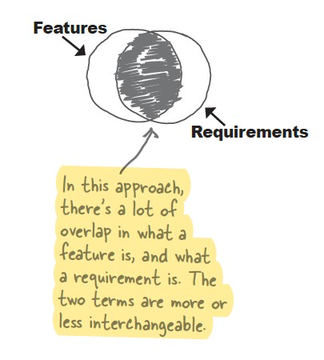

# ch6
- domain analysis 
- case diagrams
## how to look at big problem
- best way to look at big problem is to see it as lots of individual pieces of functionality
- work with only one subproblem and try to make it do what you want it to do before you move to another subproblem
## some things you already learnt may help ypu solve that big problem
- encapsulate what varies 
- coding to interface rather than to implementation make your app easy to extend
- understand what system is supposed to do ,so you will get good requirements
- make sure your app work in real world using analysis
- great sofware easy to extend and do what customer wants it to do
## we need a lot more information
- you should figure what the system look like and waht it is not like that mean you should know what the system will not do to not worry about
## diffrence between features and requirements
- there are two opinions on that some people say that features is high level of requirments and other say that freatures are requirements
- conclusion: - features are big things that lots of requirements compine to satisfy
              - features are requirements
  
 
## use cases don't always help seeing big picture
- it is not a good point to start your system with use case because that will prevent you from seeing big picture and avoid getting into much details
## diffrence between use case and use diagram 
- use case: it gives you all details of system 
- use diagram: it gives you big picture of system, it is the blueprint of system
## to make good system
- make use diagram
- make use case 
- make features list to make sure your use case is complete
## use diagram
- you can use include & extend in use diagram
## domain analysis
- describe problem in the way that customer understand
- it help you avoid buiding things in your system which is not your job to do 
