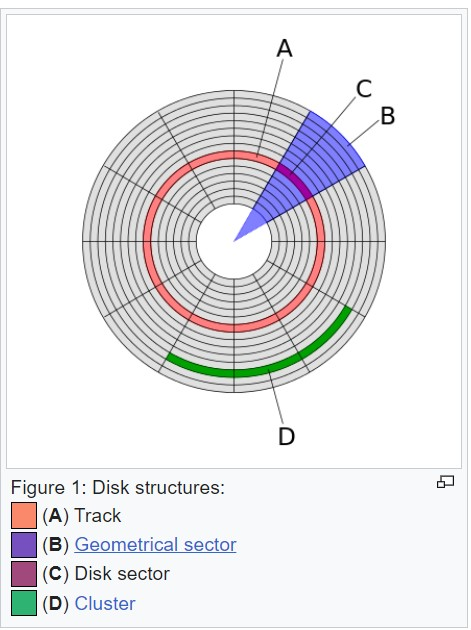

# B-tree
- it is designed to be stored in disks
- because disks are very slow, we do not measure only time that dynamic set consume but also by how many disk access they perform
- number of disk access increase with the height of b-tree
# time 
- Insert, min, union: take O(1)
- Extract min, delete: take O(logn)
- Decrease key: take O(1)
# B-tree
- they are similar to red black trees
- they are better in minimizing disk I/O operations
- if node x contain x.n keys then it will have x.n+1 children
- structure of leaf node deffer from the internal node
## diiffrence between b-tree and red black tree
- b-tree nodes may have many children (branching factor of b-tree can be quite large)
## disk

- one block in disk can store 512 bytes
- every block can store (512/sizeofdata) data in it
- it is cheaprer than main memory
- it has more capacity
- it is slower, because of mechanical motion
## b-tree access pages & main memory & information
- b-tree access conatant amount of data in it, so size of main memory doesn't affect the amount of data accessed from disk
- information is devided into many equal size pages of bits that appear within tracks
- length of each page 2^11 up to 2^14 bytes
- disk access time is not const, it depends on distance between desired track and initial track and intital positional rotation of the disk
## height of b-tree
- number of disk access is propotional to height of b-tree 
## proporities of b-tree
- attributes of node x:
   - x.n -> number of keys
   - x.n are stored in increasing order
   - x.leaf store boolean to tell us if node is leaf node
- each internal node contain x.n+1 pointers to its children
- all leaves have the same depth (h)
- nodes have at least t-1 keys and at most 2t-1 keys
# Basic operations on B-trees
- root of b-tree is always in main memory
- any node that are passed by parameters must have disk read operations performed on them
## serching in b-tree
- simillar to search in binary tree but it make x.n+1 way branching decision
## b-tree create
- it take O(1) disk operation and O(1) CPU time
-    
