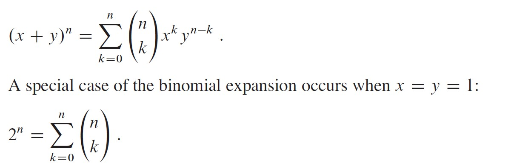
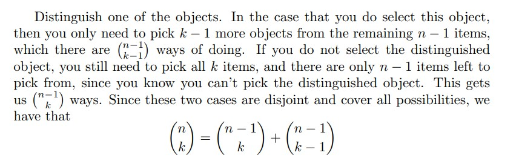

## permutations & compinations
- compinations: order not matter
- permutations: order matter
- ex: if i have 2 chars a,b then: permutation => (ab,ba), compination =>(ab) == (ba) 

## pionomial expantion

## pascal's triangle
