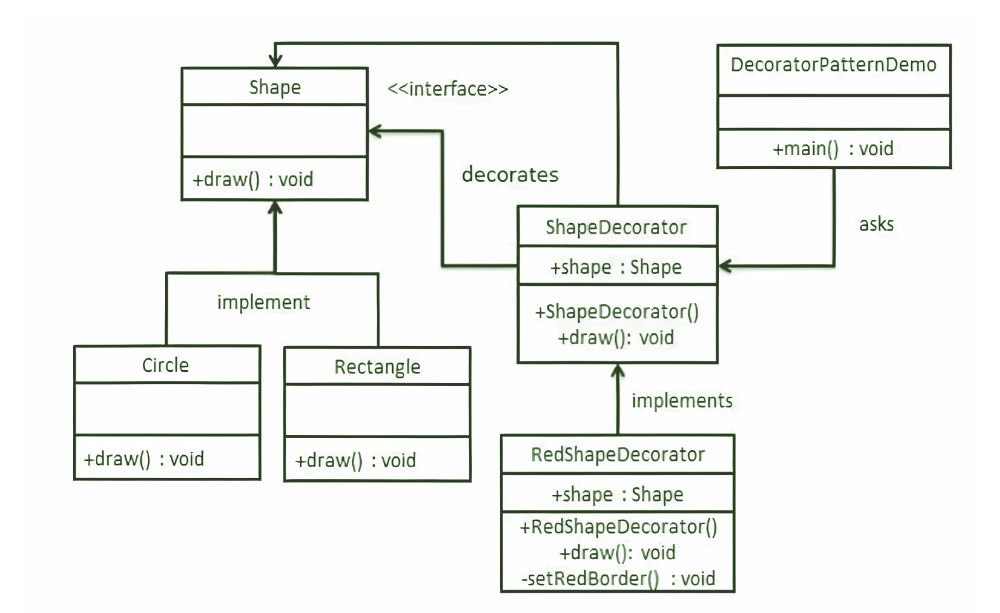

# Decorator Pattern
## remmber from OOP & SOLID
- ## composition: 
  - relation between two objects
  - child belong only one parent
  - the child can't be created or destroyed independantly, when parent created or destroyed it also desreoyed 
  - This relationship is represented in code by creating the child object as part in the parent object
- ## aggregation:
  - relation between two objects
  - child may be belong to more than one parent object and can exist independantly
  - the child can be created or destroyed independantly
  - This relationship is represented in code by creating a reference to the child object in the parent object (you may use pointers)
- form more clarify show that [video](https://youtu.be/5p04Lxc3Jug)
## Decorator Pattern
- allow us to add functionality to the class without affecting the other existing objects of the same class
- it is structural pattern which provide a wrapper to the existing class
- we use abstract class or interface to implement the wrapper
- we make decorator class which wrapp orginal class and add new functionality
- it applay single responsabilty
## procedure
1- Create an interface.

2- Create concrete classes implementing the same interface.

3- Create an abstract decorator class implementing the above same interface.

4- Create a concrete decorator class extending the above abstract decorator class. 

5- Now use the concrete decorator class created above to decorate interface objects.

6- Lastly, verify the output

- for quick revision[video](https://youtu.be/QiLtbn0NMmQ)
