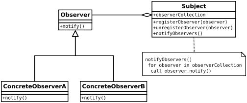

# Observer Pattern
- it has one to many dependinces between objects
- when one object changes its state all of its dependices are notified and changes automaticallly
- observers don't have access to data, they are dependent on subject to provide them data

- for quick revision[video](https://youtu.be/R-N7YWJSol8)