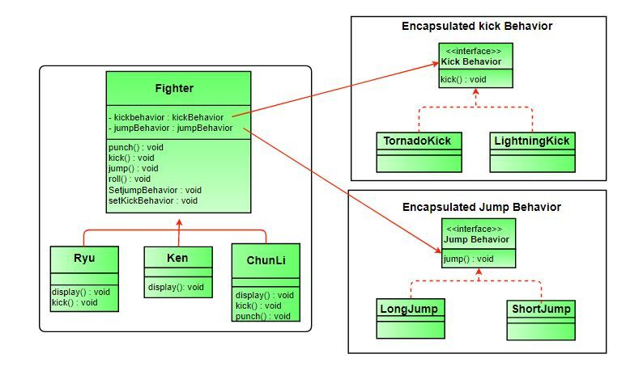

# strategy pattern
## remember form OOP & SOLID
- composition: use object of one class as property of another class
## strategy pattern
- using composition rather than inheritance
- it is based on the idea of encapsulating a family of algorithms into seprete class that implements common interface
- it consists of three main concepts: 1- context 2- strategy 3- concrete strategy
- it enables an algorithm's behavior to be selected at runtime
- ## context
  - class which contain behavior that will be changed dynamically
  ## strategy
  - is the interface or abstract class that defines the common methods for all the algorithms that can be used by the Context object
  ## concrete strategy
  - is the class that implements the Strategy interface and provides the actual implementation of the algorithm.

- for quick revision[video](https://youtu.be/1E9cusFyFUE)